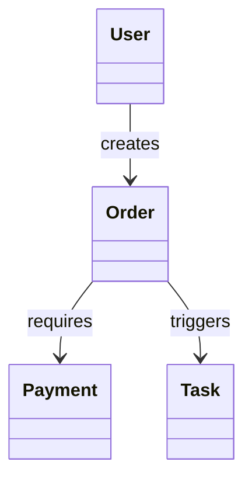

# Domain Model Templates

## Domain Object Table

```markdown
| 对象 | 类型 | 业务含义 | 关键字段 | 生命周期 | 重要性 | 源码位置 | 确认状态 |
| --- | --- | --- | --- | --- | --- | --- | --- |
| {对象名} | 核心业务对象 / 支撑业务对象 / 技术辅助对象 | ... | ... | ... | A/B/C/D/E | `path` | 已由源码确认 |
```

## Object Lifecycle

```markdown
## {对象名} 生命周期

- 创建条件：
- 初始状态：
- 主要状态：
- 终止状态：
- 谁可以改变它：
- 不能乱改的字段：
- 破坏后果：
- 源码位置：
```

## Object Relationships

```markdown

```

Use relationship labels that describe business meaning, not only technical references.
