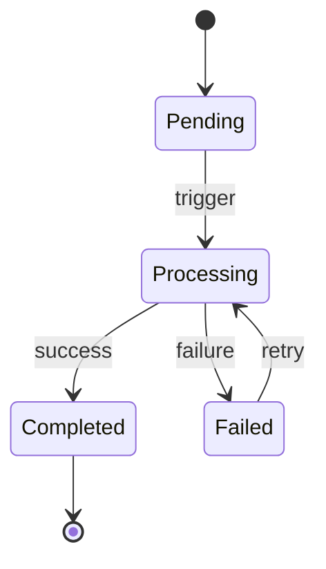

# State Machine Templates

## State Machine Document

```markdown
# 状态机：{名称}

## 状态列表

| 状态 | 业务含义 | 是否终态 | 来源 |
| --- | --- | --- | --- |

## 状态转移图



## 允许转移

| From | To | 触发条件 | 业务原因 | 源码位置 |
| --- | --- | --- | --- | --- |

## 禁止转移

| From | To | 禁止原因 | 如果允许会怎样 | 确认状态 |
| --- | --- | --- | --- | --- |

## 风险点

- 哪些状态不能跳过：
- 哪些状态不能回退：
- 哪些状态需要幂等：
- 哪些状态依赖外部系统：
```

## Forbidden Transition Note

```markdown
禁止 `{from}` -> `{to}`：
该转移会绕过 `{business_rule}`，可能导致 `{consequence}`。
确认状态：{已由源码确认 / 需要业务方确认}
```
