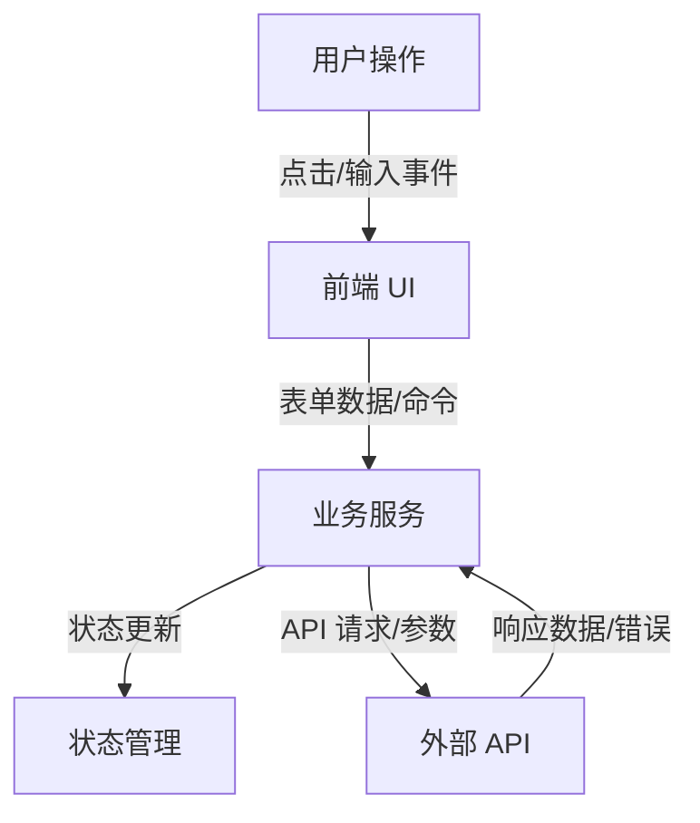
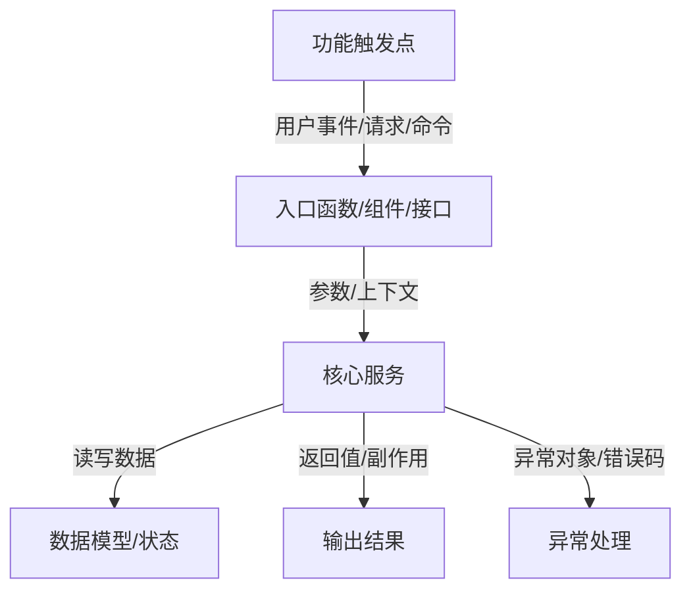

# 源码学习分析报告：{项目名称}

## 0. 学习结论摘要

| 项目 | 结论 |
| --- | --- |
| 项目类型 | {项目类型} |
| 技术栈 | {技术栈} |
| 推荐学习价值 | {高/中/低 + 原因} |
| 上手难度 | {低/中/高 + 原因} |
| 最值得看的模块 | {模块列表} |
| 暂时可以跳过的模块 | {模块列表} |

### 本次分析方式

| 项目 | 结论 |
| --- | --- |
| 分析类型 | {全量分析 / 增量重分析 / 基于缓存生成} |
| 缓存状态 | {missing_cache / clean / changed / no-cache} |
| 本次重点文件 | {变更文件或核心分析文件列表} |
| 是否建议全量重扫 | {是/否 + 原因} |

证据标注：

- **代码确认**：{从源码、配置、测试直接确认的事实}
- **结构推断**：{基于目录、命名、导入关系推断的内容}
- **需要运行验证**：{必须运行项目、测试、调试器或外部服务才能确认的内容}

## 1. 项目总览

### 一句话定位

{用一句话说明这个项目解决什么问题、面向谁、主要运行形态是什么。}

### 核心功能

- {核心功能 1}
- {核心功能 2}
- {核心功能 3}

### 技术栈

- 语言：{语言}
- 框架：{框架}
- 构建/运行：{构建工具、运行方式}
- 数据/状态：{数据库、状态管理、缓存、消息系统}
- 测试：{测试框架}

### 入口文件

| 文件 | 作用 | 证据 |
| --- | --- | --- |
| `{path}` | {作用} | {代码确认/结构推断/需要运行验证} |

### 关键配置文件

| 文件 | 说明 | 学习价值 |
| --- | --- | --- |
| `{path}` | {配置内容} | {为什么要看} |

## 2. 目录结构地图

```text
src/
  App.tsx              # 前端主入口
  services/            # 业务服务
  components/          # UI 组件
src-tauri/
  src/
    lib.rs             # Tauri 后端入口
```

### 目录学习优先级

| 优先级 | 目录/文件 | 为什么先看 |
| --- | --- | --- |
| P0 | `{path}` | {核心入口或核心业务} |
| P1 | `{path}` | {理解主流程需要} |
| P2 | `{path}` | {后续扩展时再看} |

## 3. 架构关系图



### 模块关系说明

| 模块 | 依赖 | 被谁调用 | 学习重点 |
| --- | --- | --- | --- |
| `{module}` | `{dependency}` | `{caller}` | {重点} |

## 4. 核心模块学习卡片

| 模块 | 职责 | 关键文件 | 关键符号 | 建议读法 |
| --- | --- | --- | --- | --- |
| {模块名} | {职责} | `{path}` | `{function/class}` | {先看什么，再看什么} |

## 5. 推荐阅读顺序

1. `{path}`：{为什么先读}
2. `{path}`：{理解入口后的下一步}
3. `{path}`：{理解核心业务}
4. `{path}`：{理解数据/状态/外部交互}

暂时不用看的内容：

- `{path}`：{原因，例如生成物、样式细节、低层工具、测试快照}

## 6. 适合学习的知识点

- {知识点 1}：对应 `{path}` / `{symbol}`
- {知识点 2}：对应 `{path}` / `{symbol}`
- {知识点 3}：对应 `{path}` / `{symbol}`

## 7. Flow 模式：功能调用链

### 功能触发点

- 触发方式：{用户操作/API/命令/事件}
- 入口：`{path}` / `{function|class|component|route}`

### 调用链

1. `{entry}` -> `{next}`
2. `{next}` -> `{service}`
3. `{service}` -> `{state/api/model}`

### 数据流

| 阶段 | 输入 | 中间状态 | 输出 | 文件 |
| --- | --- | --- | --- | --- |
| {阶段} | {输入} | {状态} | {输出} | `{path}` |

### 异常处理

- `{path}` / `{symbol}`：{错误如何被捕获、转换、展示或传播}

### 可调试断点建议

- `{path}` / `{symbol}`：{为什么适合打断点}

### Mermaid 流程图



## 8. Module 模式：模块深挖

### 模块职责

{模块负责什么，不负责什么。}

### 对外接口

| 接口/函数/类 | 调用方 | 返回/副作用 | 文件 |
| --- | --- | --- | --- |
| `{symbol}` | {调用方} | {返回值或副作用} | `{path}` |

### 内部核心函数/类

- `{symbol}`：{作用}

### 依赖关系

- 上游：{谁调用它}
- 下游：{它调用谁}
- 外部资源：{文件、网络、数据库、环境变量等}

### 数据流与状态变化

{描述输入如何变成输出，哪些状态会变化。}

### 扩展点与风险点

- 扩展点：{哪里适合改}
- 风险点：{哪里容易破坏行为}

### 推荐阅读方式

{先看公开接口，再看核心流程，再看边界处理。}

## 9. Learn-by-task 模式：通过小任务学习

### 目标任务

{用户想学习或改造的小任务。}

### 相关现有代码

| 文件 | 作用 | 为什么相关 |
| --- | --- | --- |
| `{path}` | {作用} | {关联原因} |

### 当前实现逻辑

{用短步骤描述现在怎么做。}

### 最小修改方案

1. {最小改动步骤 1}
2. {最小改动步骤 2}
3. {最小改动步骤 3}

### 修改风险

- {风险 1}
- {风险 2}

### 修改前必须理解的概念

- {概念 1}
- {概念 2}

### 建议验证方式

- {测试/运行/手动检查方式}

注意：除非用户明确说“开始实现”，否则不要直接修改代码。

## 10. 下一步最值得深挖的问题

1. {问题 1}
2. {问题 2}
3. {问题 3}
4. {问题 4}
5. {问题 5}
